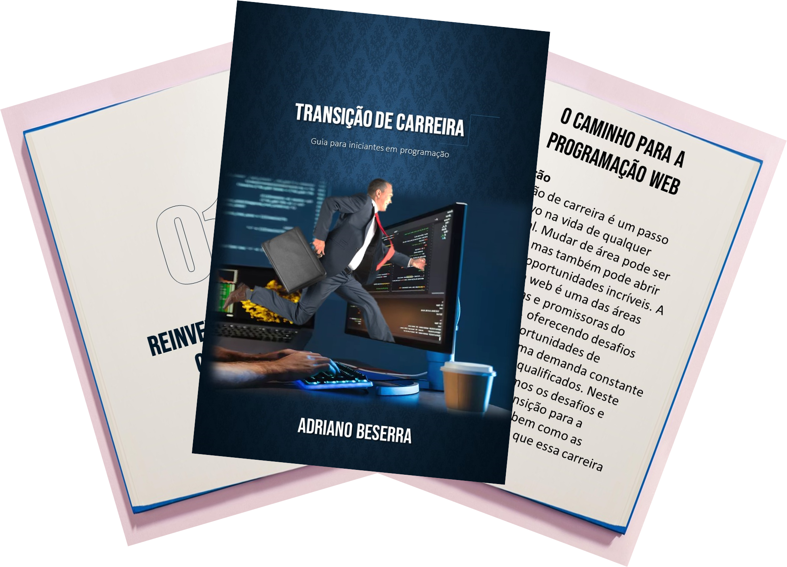

# Projeto EBOOK Gerado por I.A.s

 > ℹ️ **NOTE:** Este é o repositório desenvolvido durante o curso da [DIO](https://dio.me)

Projeto com o objetivo de gerar um ebook digital com as facilidades das ferramentas de IA. todos os prompts
seguem abaixo.

<a href="https://drive.usercontent.google.com/u/0/uc?id=1UOdUOpUi6dqdMNMNuHshv1J_JTKFS7FL&export=download" title="View PDF now"> 📕Clique aqui para ler</a>

## 💻 Tecnologias utilizadas no projeto

- [ChatGPT](https://chat.openai.com/) 
- [MidJourney](https://www.midjourney.com/app/)
- [PowerPoint](https://www.microsoft.com/en/microsoft-365/powerpoint)

## ✨ Features

- Conteúdo gerado via ChatGPT
- Imagens geradas via MidJourney

## 📚 Materiais

- Imagens utilizadas em `assets`

## 🛠️ Instruções de execução

Utilize os prompts acima nas ferramentas sugeridas para gerar o material base e utilize uma ferramenta de edição de documentos como power point, libreoffice, indesign para diagramação.

## 👨‍💻 Expert

    
&nbsp&nbsp&nbspAdriano Beserra 
    &nbsp&nbsp&nbsp
    <a href="https://github.com/Adriano1983">
    GitHub</a>&nbsp;|&nbsp;
    <a href="https://www.linkedin.com/in/adriano-beserra-0422541a2/">LinkedIn</a>
&nbsp;|&nbsp;
&nbsp;|&nbsp;

  

---

⌨️ com 💜 por [Adriano Beserra](https://github.com/Adriano1983)